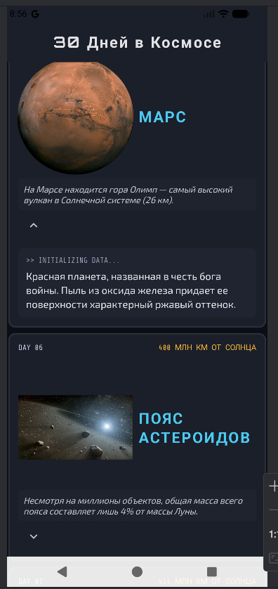

# 🪐 30 Дней в Космосе

**30 Дней в Космосе** — это интерактивный путеводитель по Солнечной системе. Каждый день открывает новую страницу истории освоения космоса, интересные факты о планетах и небесных телах.

---

## 🖼 Интерфейс приложения

  
  

---

## 🚀 Основные разделы

В текущей версии доступны детальные карточки следующих объектов:
1. **Марс** — факты о горе Олимп, химическом составе атмосферы и истории названия.
2. **Пояс астероидов** — информация о массе, расстоянии от Солнца и структуре объектов.
3. **...** 

---

## ⚙️ Функционал и особенности

- **Информативные карточки:** Краткие, но емкие факты, которые легко читать.
- **Визуальный стиль:** Глубокая темная тема с акцентным неоновым синим цветом, передающая атмосферу космоса.
- **Динамическая загрузка:** Имитация терминала (Initializing Data...) при просмотре подробностей.
- **Адаптивная верстка:** Корректное отображение на различных типах экранов.

---

## 🛠 Стек технологий

- **UI:** Jetpack Compose
- **Language:** Kotlin
- **Components:** Material 3 Design
- **Resources:** Векторная графика и высококачественные изображения планет

---

## 📥 Как протестировать
Актуальную версию можно найти во вкладке [Releases](https://github.com/bobbyFishe/SpaceApp/releases/tag/v.1.0).
